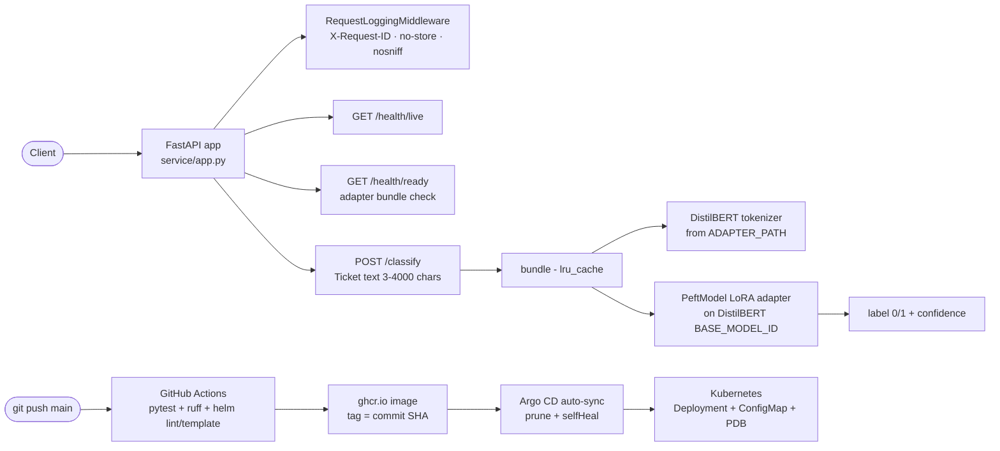

# LoRA ticket classifier

[Architecture](docs/architecture.md) · [Operations runbook](docs/operations.md) · [Helm chart](k8s/helm/lora-ticket-classifier/) · [Argo CD application](k8s/argocd/application.yaml)

## Overview

Binary support-ticket routing with parameter-efficient fine-tuning. Train a LoRA adapter on top of DistilBERT with strict split hygiene (duplicate texts rejected, train/validation overlap rejected, held-out per-epoch evaluation), export the adapter, and serve it behind a bounded FastAPI endpoint with artifact-checked readiness probes.

This is a **reference implementation**: it has not been deployed to a production cluster and makes no claims about private ticket data or live routing accuracy.

## Architecture



See [docs/architecture.md](docs/architecture.md) for request/model boundaries and [docs/operations.md](docs/operations.md) for the operator runbook.

## Measured results

Engineering measurements taken 2026-09-23 on this machine (local Linux, CPU). No business or quality metrics are claimed.

- **Tests:** 6 passed, 0 failed — `python -m pytest -q`.
- **Lint:** `ruff check .` — 0 findings (ruff 0.16.7).
- **API latency** (local uvicorn, randomly-initialized tiny DistilBERT+LoRA artifact — latency only, not a quality claim): `POST /classify` — p50 4.2ms, p95 12.9ms (n=150, 10 warmup requests, local uvicorn).
- **Helm:** `helm lint --strict` passed; `helm template` rendered in default and `--set autoscaling.enabled=true --set networkPolicy.enabled=true` modes; rendered manifests passed kubeconform strict schema validation (Kubernetes 1.30 schemas). Not applied to a live cluster.

## Setup

```sh
python -m venv .venv && source .venv/bin/activate
python -m pip install -e '.[test]'
python -m pytest -q
ruff check .
```

## Usage

Train an adapter (provide separate train/validation JSONL files with string `text` and integer `label` 0/1):

```sh
python -m service.fine_tuning data/train.jsonl data/validation.jsonl --output artifacts/ticket-lora
```

Serve it:

```sh
ADAPTER_PATH=artifacts/ticket-lora BASE_MODEL_ID=distilbert-base-uncased \
  uvicorn service.app:app --host 127.0.0.1 --port 8000
```

Classify a ticket:

```sh
curl -s -X POST http://127.0.0.1:8000/classify \
  -H 'Content-Type: application/json' \
  -d '{"text":"My laptop will not boot after the update, need help urgently"}'
# {"label":0,"confidence":0.73}
```

Health checks:

```sh
curl -s http://127.0.0.1:8000/health/live   # {"status":"alive"}
curl -s http://127.0.0.1:8000/health/ready  # {"status":"ready"} or 503
```

## API reference

| Method | Path | Description |
| ------ | ---- | ----------- |
| GET | `/health/live` | Process liveness — `{"status":"alive"}` |
| GET | `/health/ready` | 200 `{"status":"ready"}` when the adapter bundle loads; 503 otherwise |
| POST | `/classify` | Body `{"text": "..."}` (3–4000 chars) → `{"label": 0\|1, "confidence": float}`; 503 if the adapter is unavailable |

Every response carries `X-Request-ID`, `Cache-Control: no-store`, and `X-Content-Type-Options: nosniff`. Request logs record method, path, status, request ID, and duration — never bodies or query strings.

## Deployment

**Docker:** `docker build -t ghcr.io/saimudunuri04/lora-ticket-classifier:<tag> .` — the image serves `uvicorn service.app:app` on port 8000 as non-root UID 10001. CI builds and pushes the image on every `main` push with two tags — the tested commit SHA (immutable) and `latest` (rolling).

**Helm:** the single chart at `k8s/helm/lora-ticket-classifier/` renders a Deployment (rolling update, startup/readiness/liveness probes), Service, ServiceAccount, ConfigMap (`values.appEnv` → `ADAPTER_PATH`, `BASE_MODEL_ID`), PDB, and optional HPA and NetworkPolicy.

```sh
helm lint k8s/helm/lora-ticket-classifier --strict
helm template lora-ticket-classifier k8s/helm/lora-ticket-classifier --namespace lora-ticket-classifier
helm template lora-ticket-classifier k8s/helm/lora-ticket-classifier --namespace lora-ticket-classifier \
  --set autoscaling.enabled=true --set networkPolicy.enabled=true
```

**Argo CD GitOps:** push to `main` → CI (pytest, ruff, helm lint/template) tests → Docker build + push to ghcr.io (tags: commit SHA and `latest`) → `values.yaml` image tag pinned to the tested SHA → Argo CD (`k8s/argocd/application.yaml`) detects the chart change and auto-syncs with prune and selfHeal. Manifests were validated with `helm lint --strict`, `helm template`, and kubeconform strict schema validation; they have **not** been applied to a live cluster. Mount the adapter read-only and pre-cache the approved base model before serving traffic.

## Project structure

```
lora-ticket-classifier/
├── src/service/
│   ├── app.py            # FastAPI API, cached adapter bundle, /classify
│   ├── fine_tuning.py    # LoRA training CLI: split guards, per-epoch eval, export
│   └── observability.py  # request-ID middleware, security headers, JSON logs
├── tests/                # pytest: split/overlap guards, metrics, observability
├── docs/                 # architecture.md, operations.md
├── k8s/helm/lora-ticket-classifier/  # Chart, values, schema, templates, NOTES
├── k8s/argocd/application.yaml       # Argo CD app (placeholders documented inline)
├── Dockerfile            # CPU-serving image, non-root
├── pyproject.toml
└── LICENSE               # MIT
```

## CI status

`.github/workflows/ci.yml` — **test-build**: `ruff check .`, `pytest -q`, `helm lint --strict`, and `helm template` in both default and autoscaling+networkPolicy modes. **publish** (on `main`): builds and pushes `ghcr.io/saimudunuri04/lora-ticket-classifier:<commit-sha>` and `ghcr.io/saimudunuri04/lora-ticket-classifier:latest`, then pins the SHA tag in `values.yaml` so Argo CD syncs exactly the tested commit.

## License

MIT — see [LICENSE](LICENSE).
